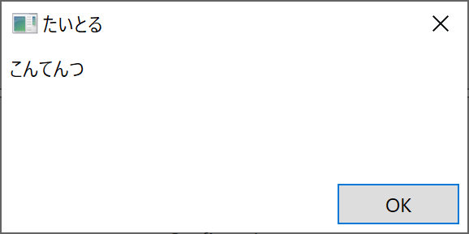
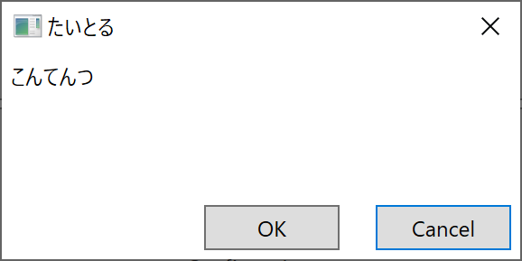
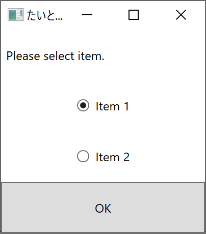
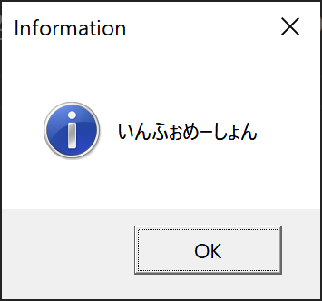
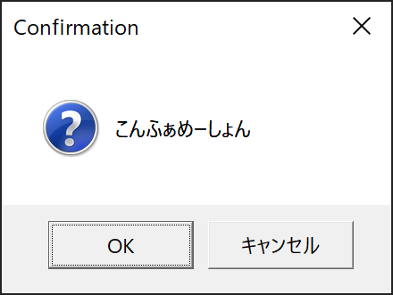
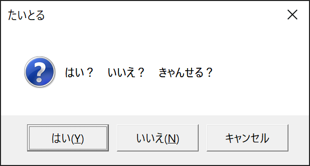
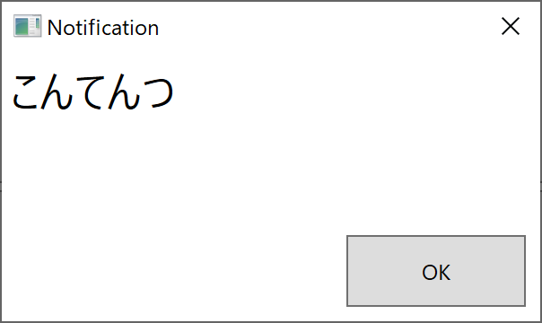
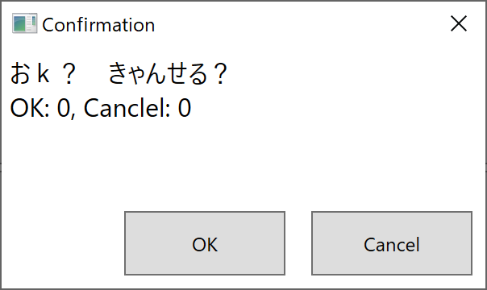

# DialogSample

ダイアログの実装サンプル

# overview

- InteractionRequestDialog
    - prismの`InteractionRequest`と`PopupWindowAction`を用いたダイアログサンプル
- InteractionRequestDialog2
    - `IInteractionRequestAware`によるカスタムViewのダイアログサンプル
- MessageBoxService
    - `InteractionRequest`を利用してWPF標準のメッセージボックスを表示するサービスクラスの実装サンプル
    - `MessageBoxResult`による分岐処理をメソッドチェインでつなげてみたサンプル
- DialogService
    - prism v7.2で追加された`DialogService`によるダイアログサンプル

# Note

- `InteractionRequest`や`Notification`はprism 7.2で`Obsolete`となったため、警告が大量にでてしまう...
    - `#pragma`で指定するかプロジェクトプロパティから警告を抑制してしまうか...
        ```cs
        // Obsolete属性による警告を抑制する
        #pragma warning disable 618
        ```


# screen shot

### InteractionRequestDialog





### InteractionRequestDialog2



### MessageBoxService







### DialogService




