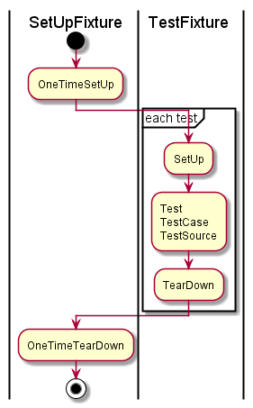

# NUnit

# overview

1. NUnitSampleプロジェクト
    - NUnitの基本的な使い方のサンプル
1. AssertThatプロジェクト
    - Assert.Thatの基本的な使い方のサンプル
        - 制約クラスの基本的な使い方
    - ConsoleRunnerのおためし
        - ビルド後イベントでConsoleRunnerを指定
        - テスト失敗はビルドエラー扱い
1. NUnitAttributeプロジェクト
    - メソッド呼び出し順序の確認
1. ParametricTestプロジェクト
    - テストデータの自動生成
    - 組み合わせテスト

# Assert

## Classic Model

https://github.com/nunit/docs/wiki/Classic-Model

## Constraint Model

https://github.com/nunit/docs/wiki/Constraint-Model

## 制約クラス

- Is
    - オブジェクトに対する制約を作成する
- Has
    - コレクションの要素に対する制約を作成する
- Does
    - 文字列に対する制約やコレクションに対する制約を作成する
- Throws
    - 例外に関する制約を作成する

# Attribute

## 基本

|Attribute|説明|
|---|---|
|SetUpFixture|テストクラスに付与する。SetUpFixtureを付与したテストクラスは、OneTimeSetUpとOneTimeTearDown以外のNUnit属性を付与したメソッドを持つことができない。 SetUpFixture属性をもつテストクラスのOneTimeSetUpのメソッドは、同一名前空間の全てのTestFixtureに先行して一度だけ実行される（OneTimeTearDownも同様、全てのTextFixtureの最後に一度だけ実行される）|
|TestFixture|テストクラス（TestFixture）|
|OneTimeSetUp|全てのテストメソッド実行前に一度だけ呼び出される|
|OneTimeTearDown|全てのテストメソッド実行後に一度だけ呼び出される|
|~~TestFixtureSetUp~~|(deprecated)|
|~~TestFixtureTearDown~~|(deprecated)|
|SetUp|各テストメソッド前に呼び出される|
|TearDown|各テストメソッド後に呼び出される|
|Test|テストメソッド|

## パラメトリックテスト

### テストデータ指定

|Attribute|説明|
|---|---|
|TestCase|テストメソッドに付与し、テストデータを指定する。指定したテストデータは、テストメソッドの引数となる。|
|TestCaseSource|テストメソッドに付与し、テストデータを返すメソッドorプロパティを指定する。指定したテストデータは、テストメソッドの引数となる。|

### テストデータ自動生成

|Attribute|説明|
|---|---|
|Random|テストメソッドの引数に付与する。ランダム値を生成する。|
|Range|テストメソッドの引数に付与する。指定した範囲内の値を生成する。|
|Values|テストメソッドの引数に付与する。指定したパラメータセットの値を生成する。|
|ValueSource|テストメソッドの引数に付与する。指定したメソッドorプロパティの値を生成する。|

以下の属性で、組み合わせ方法を指定できる。

|Attribute|説明|
|---|---|
|Combinatiorial|全組み(default)|
|Pairwise|ペアワイズ法（オールペア法）|
|Sequential|順組み|

## その他

|Attribute|説明|
|---|---|
|Property|テストクラスorテストメソッドで利用できるプロパティを定義できる。|
|MaxTime|実行時間が指定した時間を超過している場合、テスト失敗となる。|
|Timeout|実行時間が指定した時間を超過した時、ただちにテストメソッドはキャンセルされ、テスト失敗となる。|

全Attribute (NUnit doc)
- https://github.com/nunit/docs/wiki/Attributes
