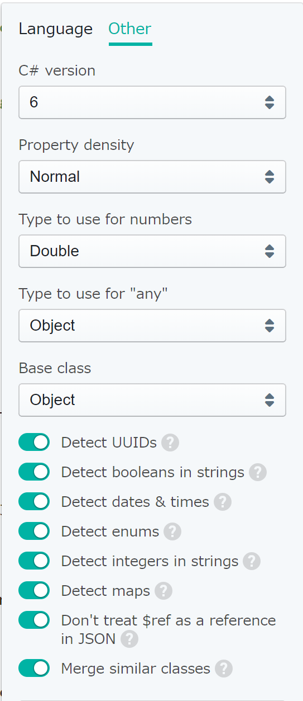

# quicktype

JSONのシリアライズ・デシリアライズコードを自動生成するquicktypeの試用プロジェクト

- webサービス
    - https://app.quicktype.io/
- FAQ
    - https://github.com/quicktype/quicktype/blob/master/FAQ.md
- github
    - https://github.com/quicktype/quicktype
- VSCode用extension
    - https://marketplace.visualstudio.com/items?itemName=quicktype.quicktype
- VisualStudio用アドイン
    - https://marketplace.visualstudio.com/items?itemName=typeguard.quicktype-vs

# overview

- QuicktypeCS
    - webサービスで自動生成した**C#コード**の試用プロジェクト
    - `Newtonsoft.Json`用のC#コードが生成される
- QuicktypeCpp
    - webサービスで自動生成した**C++コード**の試用プロジェクト
    - JSON for Modern C++が必要
    - 自動生成されたコードではboostヘッダをインクルードしているが、コメントアウトしても、サンプルjsonでは問題なくシリアライズ・デシリアライズ可能
    - boostヘッダ依存はオプションで変更可能
    - boostヘッダを使用しない場合、C++17で追加された`<optional>`ヘッダ依存となる
- QuicktypeCpp2
    - 自動生成コードを、`boost/optional.hpp`ではなくC++17の`<optional>`ヘッダとしたC++コードのお試しプロジェクト
- QuicktypeCpp3
    - ビルド前イベントで`quicktype`コマンドを実行するサンプル
    - npmパッケージを利用
    - オプションを変更した際の生成コード確認用
- QuicktypeCpp4
    - 複数のjsonファイルを入力とし、`--source-style multi-source`としたサンプル
        - 下記オプションで変換エラーが表示されるが、特に問題なくhppファイルが生成される
            ```
            > quicktype --lang=c++ --include-location global-include --no-boost --src=json/ --source-style multi-source --out=./
            ```
        - `--source-style multi-source`と`--msbuildPermissive use-permissive`を合わせて使うと、`Generators.hpp`で下記ようのコードが生成されてしまい、ビルドできない
            ```cpp
            #include "quicktype::Foo.hpp"
            ```
    - 生成コード確認のため、変換コマンドはビルドイベントに登録していない
    - yarnパッケージを利用

# 利用方法

- webサービス
- npmパッケージ
- VSCode用extension
- VisualStudio用アドイン

# 出力コードのカスタマイズ

自動生成コードをある程度カスタマイズできる.

## npmパッケージ版

- C#用オプション
    ```
    Options for C#

    --namespace NAME                                  Generated namespace
    --csharp-version 5|6                              C# version
    --density normal|dense                            Property density
    --array-type array|list                           Use T[] or List<T>
    --number-type double|decimal                      Type to use for numbers
    --features complete|attributes-only|just-types    Output features
    --[no-]check-required                             Fail if required properties are missing (off by default)
    --any-type object|dynamic                         Type to use for "any"
    --base-class EntityData|Object                    Base class
    ```
- C++用オプション
    ```
    Options for C++

    --[no-]just-types                                 Plain types only (off by default)
    --namespace NAME                                  Name of the generated namespace(s)
    --code-format with-struct|with-getter-setter      Generate classes with getters/setters, instead of structs
    --wstring use-string|use-wstring                  Store strings using Utf-16 std::wstring, rather than Utf-8 std::string
    --msbuildPermissive not-permissive|use-           Moves to_json and from_json types into the nlohmann::details namespace, so that msbuild can build it with conformance mode disabled permissive
    --const-style west-const|east-const               Put const to the left/west (const T) or right/east (T const)
    --source-style single-source|multi-source         Source code generation type,  whether to generate single or multiple source files
    --include-location local-include|global-include   Whether json.hpp is to be located globally or locally
    --type-style pascal-case|underscore-case|camel-   Naming style for types
    case|upper-underscore-case|pascal-case-upper-
    acronyms|camel-case-upper-acronyms
    --member-style underscore-case|pascal-            Naming style for members
    case|camel-case|upper-underscore-case|pascal-
    case-upper-acronyms|camel-case-upper-acronyms
    --enumerator-style upper-underscore-              Naming style for enumerators
    case|underscore-case|pascal-case|camel-
    case|pascal-case-upper-acronyms|camel-case-
    upper-acronyms
    --enum-type NAME                                  Type of enum class
    --[no-]boost                                      Require a dependency on boost. Without boost, C++17 is required (on by default)
    ```
- C++用オプション覚書
    - `--include-location global-include`を指定することにより、インクルード文が`"json.hpp"`ではなく`<nlohmann/json.hpp>`になる
    - `--no-boost`を指定することにより、インクルード文が`<boost/optional.hpp>`ではなく`<optional>`になる（要C++17）
    - `--msbuildPermissive use-permissive`を指定することにより、VisualStudioでのビルド時、標準への準拠モード（/permissive-）を設定しなくても（設定ダイアログで"いいえ"の状態）よくなる.


## webサービス版

- C#用オプション

    
    

- C++用オプション

    
    

# 覚書

- VSCode extensionの設定
    - デフォルト設定のままではクラス構造のみの生成となり、シリアライズ（デシリアライズ）コードは生成されない
    - 設定項目の`Just Types`をOFFにすることで当該コードが生成されるようになる
- VisualStudio2017で自動生成コードをビルドする場合の注意点
    - 自動生成コードは、標準への準拠モードを設定（`/permissive-`）しないとビルドエラーとなる
    - プロジェクト作成で`/permissive-`はデフォルトで設定されるが、Qt(VS2017)でビルドする場合等、注意すること
    - quicktypeオプションにより、`/permissive-`がなくてもVisualStudioでビルドできるコードを出力することができる
