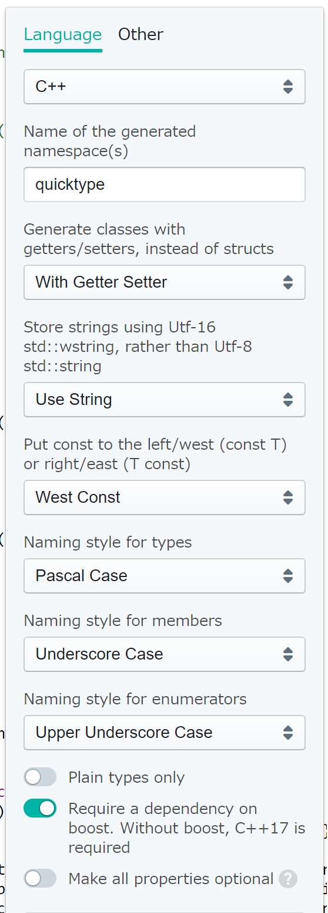

# quicktype

JSONのシリアライズ・デシリアライズコードを自動生成するquicktypeの試用プロジェクト

- webサービス
    - https://app.quicktype.io/
- FAQ
    - https://github.com/quicktype/quicktype/blob/master/FAQ.md
- github
    - https://github.com/quicktype/quicktype
- VSCode用extension
    - https://marketplace.visualstudio.com/items?itemName=quicktype.quicktype
- VisualStudio用アドイン
    - https://marketplace.visualstudio.com/items?itemName=typeguard.quicktype-vs

# overview

- QuicktypeCS
    - webサービスで自動生成した**C#コード**の試用プロジェクト
    - `Newtonsoft.Json`用のC#コードが生成される
- QuicktypeCpp
    - webサービスで自動生成した**C++コード**の試用プロジェクト
    - JSON for Modern C++が必要
    - 自動生成されたコードではboostヘッダをインクルードしているが、コメントアウトしても、サンプルjsonでは問題なくシリアライズ・デシリアライズ可能
    - boostヘッダ依存はオプションで変更可能
    - boostヘッダを使用しない場合、C++17で追加された`<optional>`ヘッダ依存となる
- QuicktypeCpp2
    - 自動生成コードを、`boost/optional.hpp`ではなくC++17の`<optional>`ヘッダとしたC++コードのお試しプロジェクト

# 利用方法

- webサービス
- npmパッケージ
- VSCode用extension
- VisualStudio用アドイン

# 出力コードのカスタマイズ

webサービスでは、自動生成コードをある程度カスタマイズできる.

- C#用オプション

    

- C++用オプション

    

# 覚書

- VSCode extensionの設定
    - デフォルト設定のままではクラス構造のみの生成となり、シリアライズ（デシリアライズ）コードは生成されない
    - 設定項目の`Just Types`をOFFにすることで当該コードが生成されるようになる
- VisualStudio2017で自動生成コードをビルドする場合の注意点
    - 自動生成コードは、標準への準拠モードを設定（`/permissive-`）しないとビルドエラーとなる
    - プロジェクト作成でpermissiveはデフォルトで設定されるが、Qt(VS2017)でビルドする場合等、注意すること
