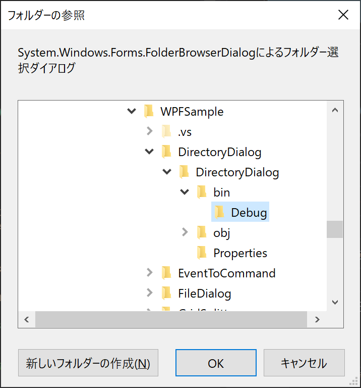
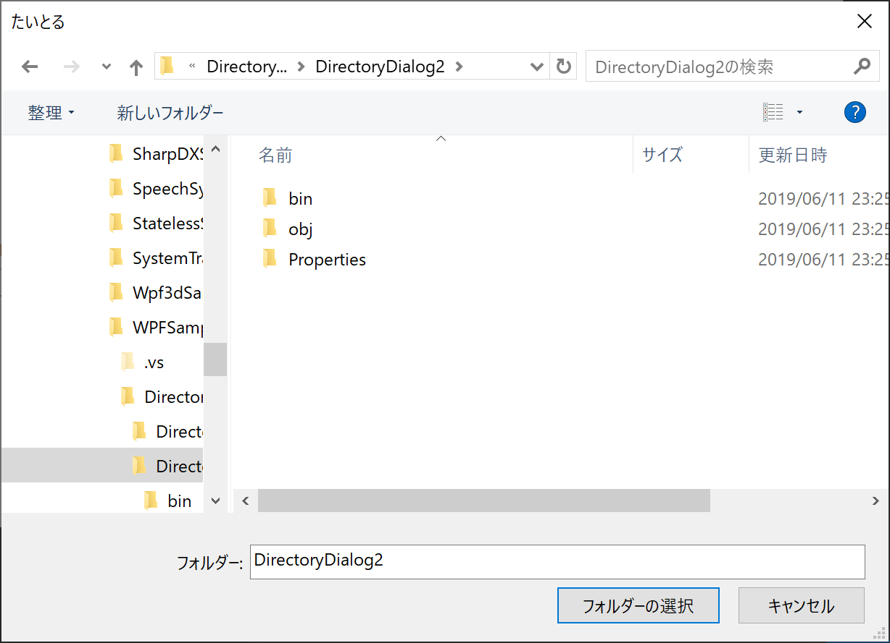

# Directory Dialog

ディレクトリ選択ダイアログのサンプル

# overview

- DirectoryDialog
    - `System.Windows.Forms.FolderBrowserDialog`によるダイアログ
    - 
- DirectoryDialog2
    - `Microsoft.WindowsAPICodePack.Dialogs.CommonOpenFileDialog`によるダイアログ
    - nugetパッケージ`Microsoft-WindowsAPICodePack-Shell`を利用
    - 亜種？が多数あるが、おそらく、どれもそんなに変わらないと思われる
    - Windows.Form版に比べて、プロパティから細かく設定できそう（未検証）
    - 
